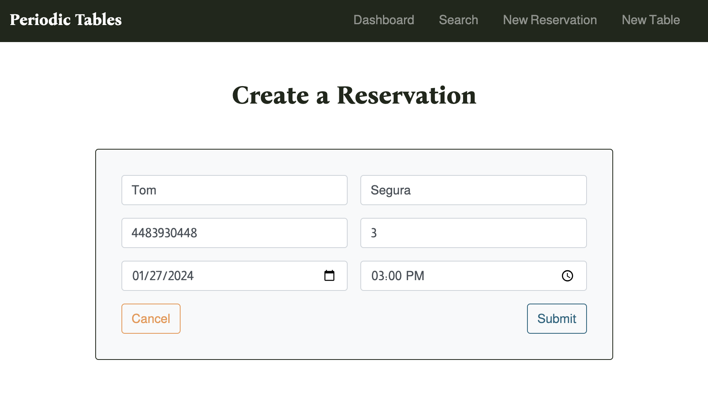
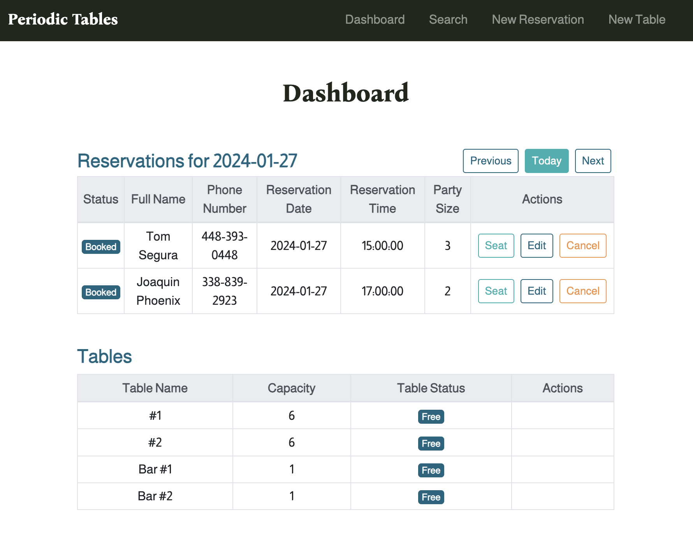
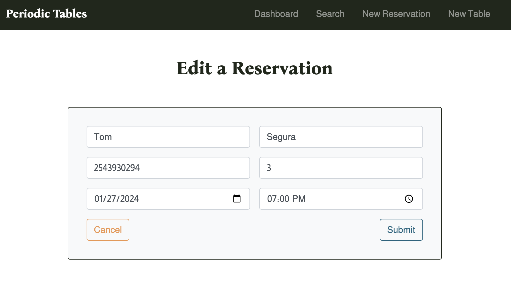
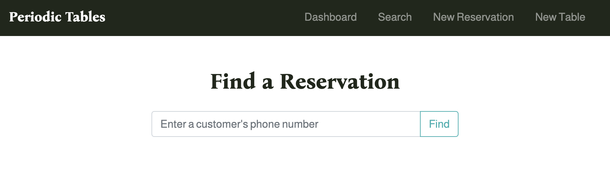
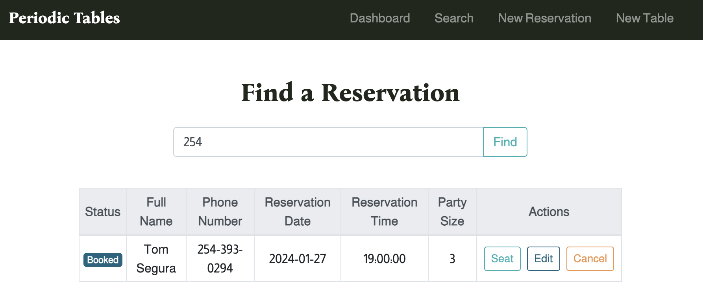
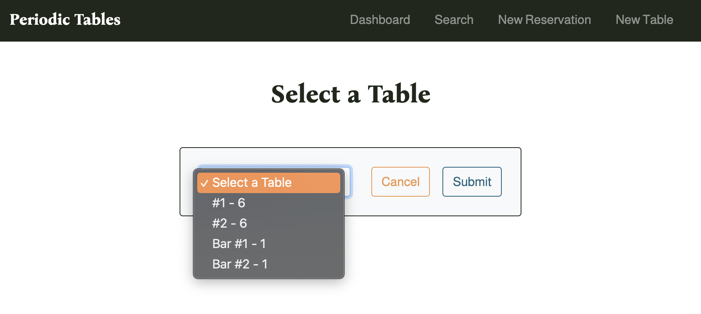
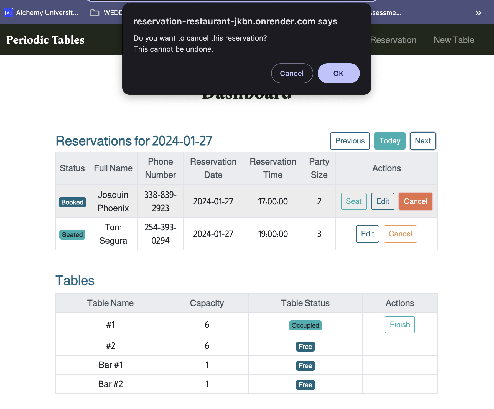
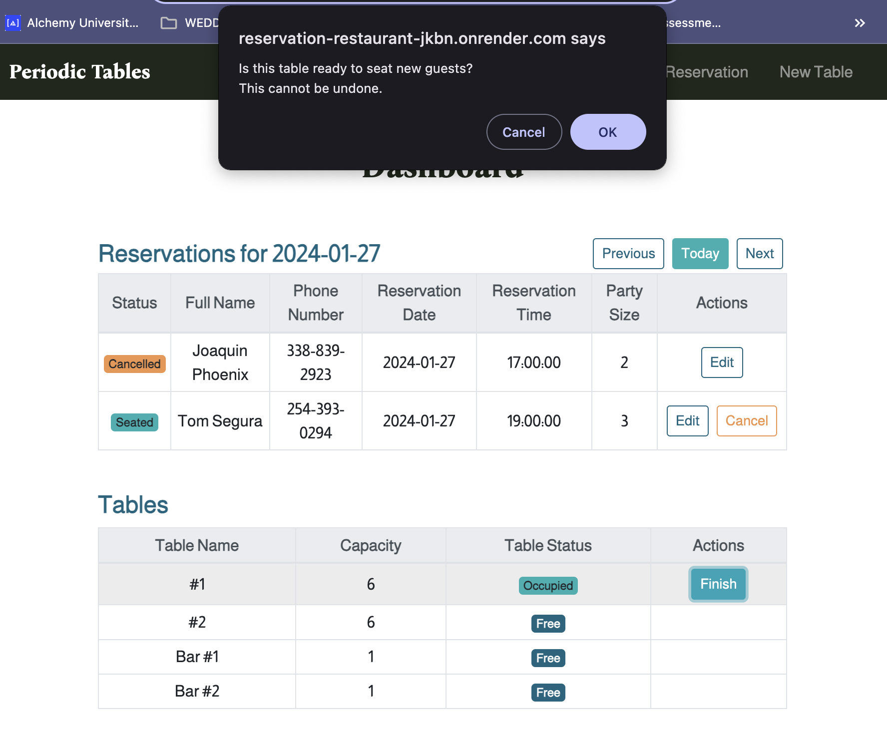
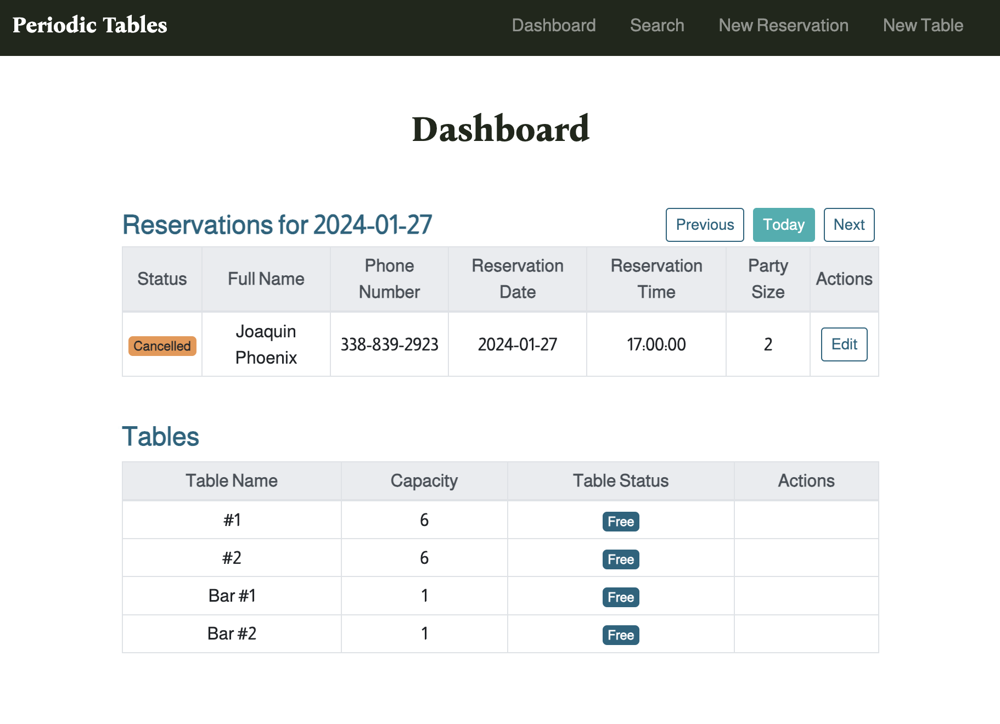

# Periodic Tables

**Live Application:** [Periodic Tables](https://reservation-restaurant-jkbn.onrender.com)

## Summary

Periodic Tables is a reservation system designed for fine dining restaurants, empowering restaurant managers to efficiently handle reservations, manage tables, and elevate the overall dining experience. The application supports key features such as reservation creation, editing, cancellation, and table seating for guests.

### User Case & Research
The user stories defined the scope of the project, addressing the needs of restaurant managers. Research into industry-standard practices for reservation systems and feedback from potential users informed the design and functionality of Periodic Tables.

---

## Screenshot Demo
#### Create and Manage Reservations

#### Dashboard Overview - Reservations for January 27, 2024

#### Edit Existing Reservation

#### Search Reservations by Phone Number

#### Seat a Guest and Manage Reservations

#### Cancel Reservation and Finish Dining

---

## API Documentation

The following provides an overview of the API endpoints used in the frontend of the Periodic Tables application.

### 1. List Reservations

- **Endpoint:** `/reservations`
- **Method:** `GET`
- **Description:** Retrieves all existing reservations.
- **Parameters:**
  - `params` (optional): Additional parameters for filtering (e.g., date).
  - `signal`: AbortSignal for handling aborts.

### 2. Read Reservation

- **Endpoint:** `/reservations/:reservation_id`
- **Method:** `GET`
- **Description:** Retrieves details of a specific reservation.
- **Parameters:**
  - `reservation_id`: Identifier for the reservation.
  - `signal`: AbortSignal for handling aborts.

### 3. Create Reservation

- **Endpoint:** `/reservations`
- **Method:** `POST`
- **Description:** Creates a new reservation.
- **Parameters:**
  - `reservation`: Object containing reservation data.
  - `signal`: AbortSignal for handling aborts.

### 4. Finish Reservation

- **Endpoint:** `/tables/:table_id/seat`
- **Method:** `DELETE`
- **Description:** Marks a table as finished/seated.
- **Parameters:**
  - `table_id`: Identifier for the table.
  - `signal`: AbortSignal for handling aborts.

### 5. Edit Reservation

- **Endpoint:** `/reservations/:reservation_id`
- **Method:** `PUT`
- **Description:** Edits an existing reservation.
- **Parameters:**
  - `updatedReservation`: Object containing updated reservation data.
  - `signal`: AbortSignal for handling aborts.

### 6. Cancel Reservation

- **Endpoint:** `/reservations/:reservation_id/status`
- **Method:** `PUT`
- **Description:** Cancels a reservation.
- **Parameters:**
  - `reservation_id`: Identifier for the reservation.
  - `signal`: AbortSignal for handling aborts.

### 7. Search by Mobile Number

- **Endpoint:** `/reservations`
- **Method:** `GET`
- **Description:** Searches for a reservation by mobile number.
- **Parameters:**
  - `mobile_number`: Mobile number to search for.
  - `signal`: AbortSignal for handling aborts.

### 8. List Tables

- **Endpoint:** `/tables`
- **Method:** `GET`
- **Description:** Retrieves all existing tables.
- **Parameters:**
  - `signal`: AbortSignal for handling aborts.

### 9. Create Table

- **Endpoint:** `/tables`
- **Method:** `POST`
- **Description:** Creates a new table.
- **Parameters:**
  - `table`: Object containing table data.
  - `signal`: AbortSignal for handling aborts.

### 10. Seat Tables

- **Endpoint:** `/tables/:table_id/seat`
- **Method:** `PUT`
- **Description:** Seats a reservation at a specific table.
- **Parameters:**
  - `reservation_id`: Identifier for the reservation.
  - `table_id`: Identifier for the table.
  - `signal`: AbortSignal for handling aborts.

---

## Technologies Used

- **Frontend:** React, Bootstrap, CSS
- **Backend:** Node.Js, Express, Knex

## Installation Instructions

1. Fork and clone this repository.
2. Run `cp ./back-end/.env.sample ./back-end/.env`.
3. Update the `./back-end/.env` file with the connection URL to your PostgreSQL database instance.
4. Run `cp ./front-end/.env.sample ./front-end/.env`.
5. (Optional) Update the `./front-end/.env` file if you want to connect to a backend at a location other than http://localhost:5001.
6. Run `npm install` to install project dependencies.
7. Run `npm run start:dev` to start your server in development mode.

## Future Goals
In the next phases of building Periodic Tables, I'm excited to: 

I. **Fine-Tuning Validation:** enhance validation checks to ensure that only accurate and valid reservation data makes its way into the system. This will help maintain data integrity and reliability.

II. **Sleek User Interface:** add some design enhancements! Expect updates that will not only make the application more visually appealing but also provide users with an even smoother and more enjoyable experience.