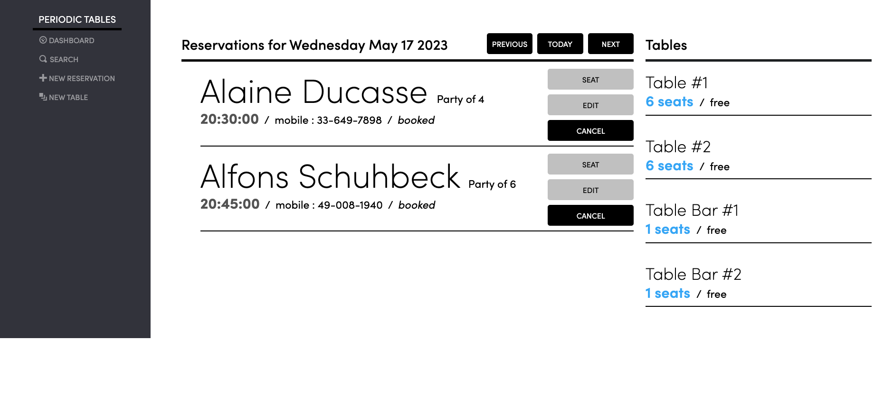
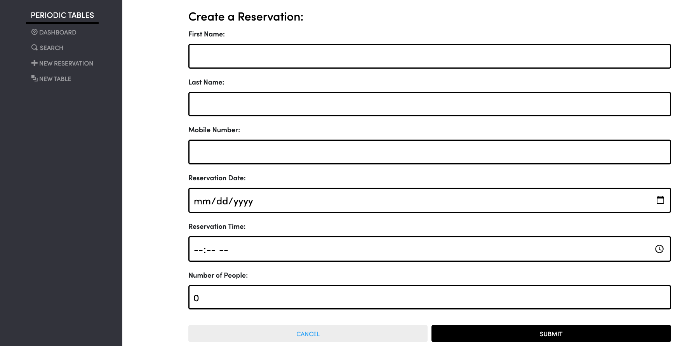
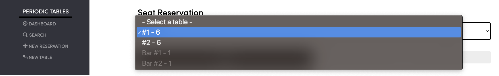
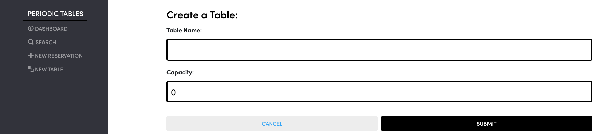
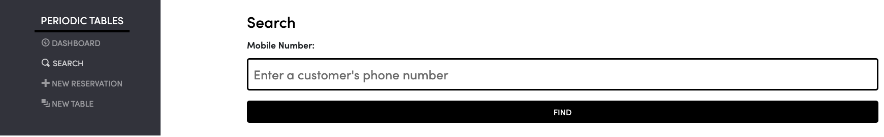

# Restaurant-Reservation-App

## Summary 
The purpose of this project was to use the technology resources that I learned during the Thinkful curriculum. The Restaurant Reservation App is a testiment to the hours spent learning about database, middleware, and front end programming. With this application, a user can easily use and maintain a system that tracks reservation data for their customers. 

 

### Frontend and Backend applications deployed using Render
* Link to front-end: https://reservation-app-frontend-7m2v.onrender.com
* Link to back-end: https://restaurant-reservation-app-backend-ryfi.onrender.com

 

### Dashboard
The Dashboard page lists all of the reservations for a given date. Each reservation has customer information such as first name, last name, and phone number. The time, date, and status are also displayed to the user in neat sections. 

|Request| Path	      | Description|
|-------|-------------|------------|
|GET    |/reservations|list all reservations, sorted by time|
|POST	  |/reservations|	create a new reservation
|GET	  |/reservations/:reservation_id|read a reservation by reservation_id|
|PUT	  |/reservations/:reservation_id|update a reservation by reservation_id|
|PUT	  |/reservations/:reservation_id/status| update a reservation status by reservation_id|
|GET    |	/reservations?mobile_number=XXXXXXXXXX|	list all reservations for one mobile number, sorted by time|
|GET|	/reservations?date=XXXX-XX-XX|	list all reservations for one date, sorted by time|
|GET|	/tables	|list all tables, sorted by table name|
|POST| /tables|	create a new table|
|PUT|	/tables/:table_id/seat|	update a table and assign it to a reservation|
|DELETE|	/tables/:table_id/seat|	free an occupied table by deleting assigned reservation_id|

 

### Reservation
The reservation page is designed to capture information for the customer and to add it to the list of reservations.

 

### Seating
When a customer arrives and is time to be placed according to their capacity, the seating capability is available on the reservation. A drop down menu displays available seating with enough room for everyone on the reservation.

 

### Table
When there aren't enough tables in the restaurant space, the new table functionality is there to help. With this basic form, a user can easily add a table name and capacity to the list of tables. 

 

### Search
The search option is a useful feature for searching a reservation using a customer's mobile number.

 

### Edit Reservation
If guest information needs to be updated, the edit reservation feature provides a form to edit any information regarding the reservation. The guests information is automatically populated in their respective text fields.

 

### Technology used
* PostgresSQL database,
* Knex (data migration tool),
* Express middleware,
* React Libraries,
* Node

 

### Instructions
1. Installation
2. Fork and clone this repository.
3. Run cp ./back-end/.env.sample ./back-end/.env.
4. Update the ./back-end/.env file with the connection URL's to your ElephantSQL database instance.
5. Run cp ./front-end/.env.sample ./front-end/.env.
You should not need to make changes to the ./front-end/.env file unless you want to connect to a backend at a location other than http://localhost:5001.
6. Run npm install to install project dependencies.
7. Run npm run start:dev to start your server in development mode.