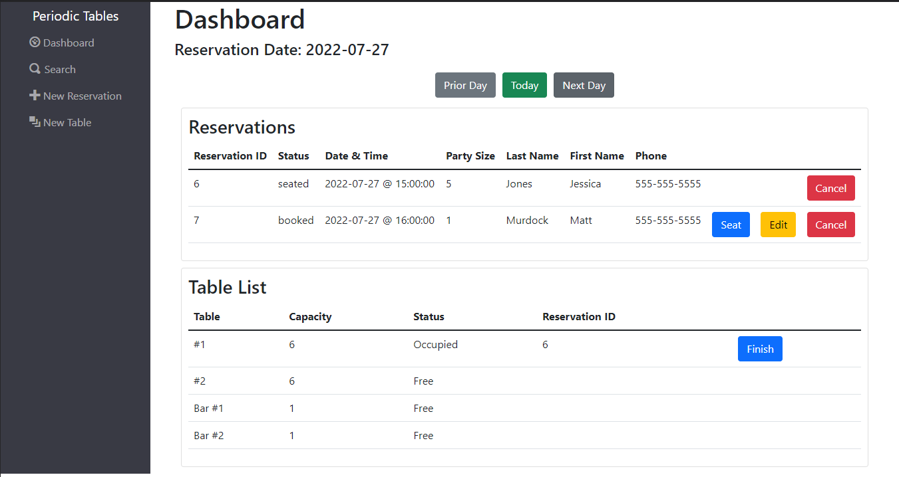
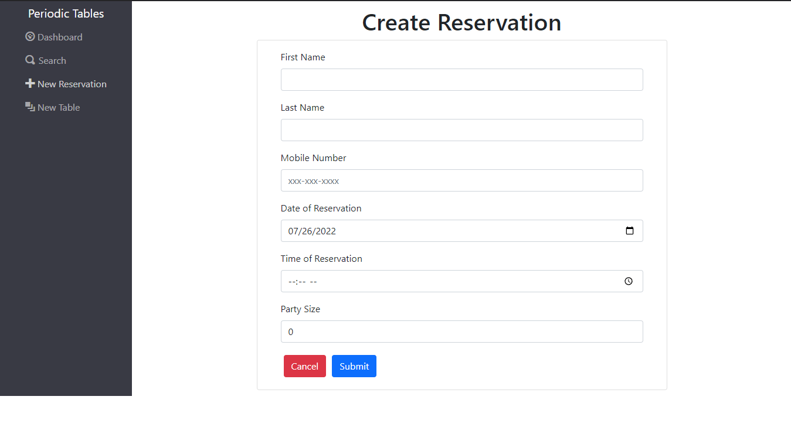
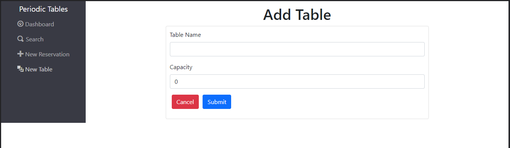
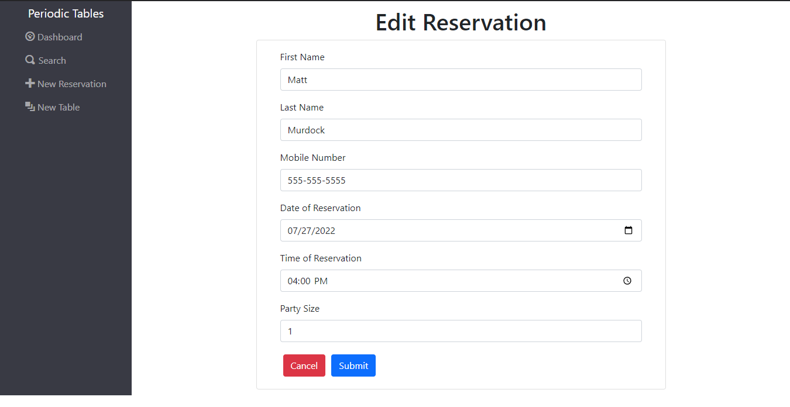
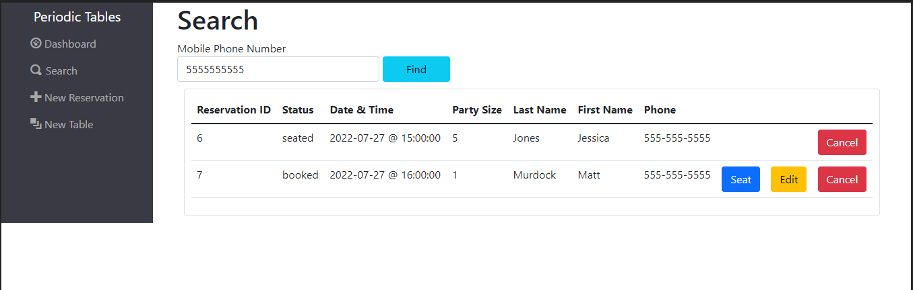

# Restaurant Reservation: `Periodic Tables`

### Links

---
## Project Description

A restaurant reservation system designed to allow for:
- The creation of reservations
- The creation of tables for the assignment of reservations
- Reservation status tracking and updating
- Reservation navigation by date
- Table tracking and status managment
- The ability to search for reservations given a mobile telephone number
- The display of Front-end API call error responses
- The use of a RESTful API with comprehensive validation

---
## Project Task: Restaurant Reservation System

> You have been hired as a full stack developer at _Periodic Tables_, a startup that is creating a reservation system for fine dining restaurants.
> The software is used only by restaurant personnel when a customer calls to request a reservation.
> At this point, the customers will not access the system online.

---
## Files

This repository is set up as a _monorepo_, meaning that the frontend and backend projects are in one repository. This allows you to open both projects in the same editor.

- React components: `./front-end/src`
- Server: `./back-end/src`

## Tech Stack

-   PostgreSQL
-   Express
-   React
-   Node.js

## Installation

1. Fork and clone this repository.
1. Run `cd back-end/`.
1. Run `npm install`.
1. Create the `./back-end/.env` file with the connection URL's to your ElephantSQL database instance. URL names can be found imported in the `knexfile.js`.
1. Run `npx knex migrate:latest` then `npx knex seed:run`
1. Run `cd front-end/`.
1. Run `npm install`.
1. Create the `./front-end/.env` file with `REACT_APP_API_BASE_URL=http://localhost:5001`.
1. Run `npm run start:dev` to start your server in development mode from the main directory.

---
## Screenshots

### Dashboard

### Create Reservation

### Create Table

### Edit Reservation

### Search
